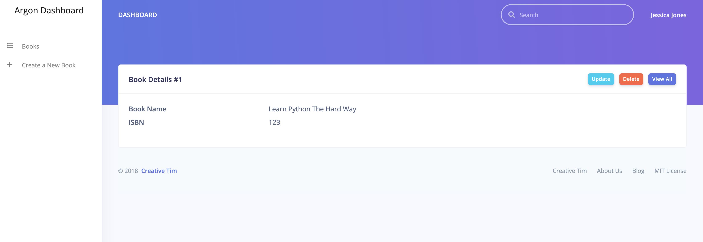

# djlibrary

This project is built using Django and demonstrates the use of Class Based Views using [Class Based Views in Django](https://medium.com/all-about-django/class-based-views-in-django-89108c1f51fb).

It extends over the tutorial and uses [Argon Design System](https://www.creative-tim.com/product/argon-design-system) and [Argon Dashboard](https://www.creative-tim.com/product/argon-dashboard) to build CRUD interfaces for a model.

## Snaps

* ListView


* CreateView


* DetailView



* UpdateView


* DeleteView


## Setup Instructions

First make sure that you have the following installed.

* Python 3 and virtualenv

Now do the following to setup project

```
# assuming that the project is already cloned.

cd djlibrary

# one time
virtualenv -p $(which python3) pyenv

source pyenv/bin/activate

# one time or whenever any new package is added.
pip install -r requirements/dev.txt

# update settings
cp src/djlibrary/settings/local.sample.env src/djlibrary/settings/local.env

# generate a secret key or skip(has a default value) and then replace the value of `SECRET_KEY` in environment file(here local.env)
./scripts/generate_secret_key.sh

# update relevant variables in environment file

# run migrate
cd src
python manage.py migrate
```

To access webserver, run the following command

```
cd src
python manage.py runserver
```

## Credits

Special Thanks to [Creative Tim](https://www.creative-tim.com/) for awesome [Argon Design System](https://www.creative-tim.com/product/argon-design-system)
